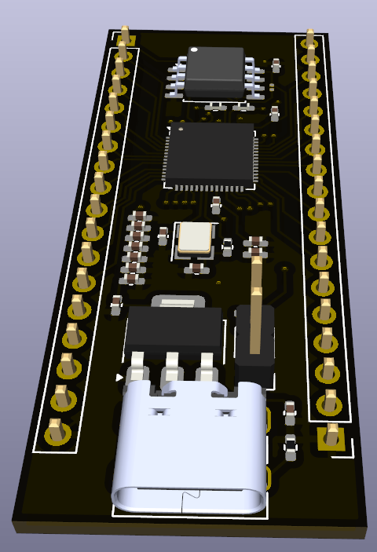

# Custom Pi Pico Board Design

This repository contains the KiCAD design files for a custom-built Pi Pico board. The design was made entirely from scratch, utilizing KiCAD for PCB design and component placement. The board is based on the Raspberry Pi Pico microcontroller, featuring the RP2040 chip, and adheres to the original specifications with a few custom modifications.

## Project Overview

The Pi Pico is a low-cost, high-performance microcontroller board built around the Raspberry Pi RP2040 chip. This project involves creating a custom version of the Pi Pico using KiCAD, incorporating specific design requirements and optimizations.

### Key Features:
- **RP2040 Chip**: Dual-core ARM Cortex M0+ processor.
- **Custom PCB Layout**: Designed from scratch using KiCAD, following the original Pi Pico dimensions and pinout.
- **Minimalist Design**: Optimized for reduced footprint and enhanced performance.
- **I/O Accessibility**: Exposes GPIO pins for custom hardware interfacing.
- **Power Management**: Includes onboard power regulation for stable operation.
  
## Getting Started

### Prerequisites:
- **KiCAD**: Download and install [KiCAD](https://kicad.org/) to view and modify the design files.
- **RP2040 Documentation**: Refer to the [official RP2040 datasheet](https://www.raspberrypi.org/documentation/rp2040) for detailed information about the chip.
  
## Customizations

The board design can be customized in various ways:
- **Form Factor**: Adjust the board size or shape to suit specific requirements.
- **GPIO Configuration**: Modify the GPIO pin layout or functionality to match your project needs.
- **Power Supply**: Change the power input options or improve power management for different applications.

## Contributing

Contributions are welcome! If you have suggestions for improvements or additional features, feel free to open an issue or submit a pull request.

## License

This project is licensed under the MIT License. See the [LICENSE](./LICENSE) file for more details.

## Acknowledgments

- **Raspberry Pi Foundation**: For providing the RP2040 chip and the original Pi Pico design.
- **KiCAD Community**: For making an excellent open-source PCB design tool.

